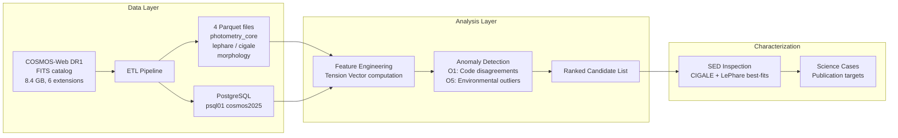

<!--
---
title: "COSMOS2025 Anomaly Detection"
description: "Systematic anomaly detection on the COSMOS-Web DR1 photometric catalog — exploiting tension between independent measurements to find scientifically valuable outliers"
author: "VintageDon"
date: "2026-03-01"
version: "0.2"
status: "Phase 1 — ETL Pipeline Design"
tags:
  - type: project-root
  - domain: [astronomy, anomaly-detection, data-science]
  - tech: [python, postgresql, astropy, scikit-learn, jwst]
related_documents:
  - "[COSMOS-Web DR1 Catalog](https://cosmos-web.astro.caltech.edu/)"
  - "[RadioAstronomy.io Organization](https://github.com/radioastronomyio)"
---
-->

# 🔭 COSMOS2025 Anomaly Detection

[](https://python.org)
[](https://postgresql.org)
[](https://cosmos-web.astro.caltech.edu/)
[](LICENSE)

> Systematic anomaly detection on the COSMOS-Web DR1 galaxy catalog — hunting for high-value scientific discoveries in the largest contiguous JWST survey to date.

This project applies outlier detection methods to the COSMOS2025 photometric catalog (Shuntov et al. 2025), a 784,016-source dataset spanning 37 photometric bands from UV through mid-infrared. The approach exploits *tension between independent measurements* — where two SED fitting codes disagree on a galaxy's properties, or where a galaxy's star formation rate defies its environment, something physically interesting is happening.

Two primary science opportunities drive the analysis:

- **O1 — Algorithmic Disagreement:** Mining residuals between LePhare and CIGALE SED fitting codes to find objects where standard templates fail. Δlog(M*) > 0.3 dex or Δlog(SFR) > 0.5 dex signal extreme emission line galaxies, obscured AGN, or decoupled UV/IR star formation.
- **O5 — Contextual Anomalies:** Cross-referencing galaxy properties against large-scale structure density maps to find environmental outliers — massive starbursts in cluster cores, quenched dwarfs in cosmic voids.

The project is catalog-only — no image-level analysis, no spectroscopy, no proprietary data. Everything is derived from publicly available COSMOS-Web DR1 data products.

---

## 📊 Project Status

| Area | Status | Description |
|------|--------|-------------|
| Data acquisition | ✅ Complete | All DR1 catalog products downloaded; CIGALE SEDs extracted (436GB); LePhare SEDs archived (not extracted) |
| Literature landscape | ✅ Complete | GDR competitive survey identified 5 opportunity areas; O1 + O5 selected as primary targets |
| Catalog profiling | ✅ Complete | Master catalog structure characterized — 6 extensions, sentinel patterns mapped, column types inventoried |
| ETL design | ✅ Complete | 4-file parquet schema defined; PostgreSQL target schema designed; GLM 4.7 execution strategy decided |
| ETL execution | 🔲 Next | FITS → parquet → psql pipeline; delegated to GLM 4.7 via KiloCode + crystaldb Postgres MCP |
| Feature engineering | 🔲 Planned | Derived tension metrics, quality cuts, cross-extension joins |
| Anomaly detection | 🔲 Planned | Isolation Forest, SOM-based density estimation on tension features |
| Characterization | 🔲 Planned | Phase 2 — SED-level analysis of top candidates |

---

## 🏗️ Architecture

### Workflow



### Compute Environment

| Stage | Environment | Hardware |
|-------|-------------|----------|
| ETL, exploration, feature engineering | Local workstation | RTX 3080 12GB |
| Production pipelines | gpu01 (cluster) | A4000 16GB, 12 vCPU, 48GB RAM |
| Catalog queries | psql01 (cluster) | PostgreSQL with pgvector, PostGIS |

---

## 📁 Repository Structure

```
cosmos2025-anomalies/
├── assets/                       # Banner images, diagrams
├── configs/                      # Data paths, DB connection, parameters
├── docs/
│   ├── reference/                # Column schemas, quality flags, catalog profile
│   └── research/                 # GDR results, ETL one-pager, opportunity analysis
├── notebooks/                    # Exploration, EDA, analysis
├── shared/                       # Cross-repo utilities (tree generator)
├── src/
│   ├── etl/                      # FITS → parquet → psql pipeline
│   ├── features/                 # Derived feature computation
│   ├── detection/                # Anomaly detection methods
│   └── utils/                    # Config loading, DB helpers
├── tests/
├── AGENTS.md                     # Agent instructions and project context
└── README.md                     # This file
```

Data is stored outside the repository — see [AGENTS.md](AGENTS.md) for path conventions and the two-drive data layout.

---

## 🔬 Dataset: COSMOS-Web DR1

The master catalog provides six extensions per source, each offering a different view:

| Extension | Content | Columns | Phase 1 |
|-----------|---------|---------|---------|
| 1. Photometry | 37-band fluxes, Sérsic model, detection flags | 287 | Core columns extracted |
| 2. LePhare | Photo-z, stellar mass, SFR, chi² goodness-of-fit | 43 | All columns |
| 3. SE++ Aperture | Multi-aperture photometry (5 sizes × 37 bands) | 148 | Skipped — all array columns |
| 4. CIGALE | Non-parametric SFH, mass, instantaneous SFR | 54 | All columns |
| 5. ML Morphology | Spheroid/Disk/Irregular probabilities, delta uncertainty | 150 | Mean/std + flags (~30 cols) |
| 6. Bulge+Disk | Two-component decomposition | 461 | Deferred to Phase 2 |

Supplementary catalogs add 1,678 galaxy groups with membership probabilities (Toni et al. 2025) and per-source overdensity values across 314 redshift slices (Hatamnia et al. 2025).

Of 784,016 sources, 694,341 carry `warn_flag = 0` (most secure). See `docs/reference/quality-flags.txt` for flag definitions and `docs/reference/master-catalog-profile.md` for the full structural profile.

### Data Products

| Data Product | Source | Size | Phase 1 Use |
|--------------|--------|------|-------------|
| Master catalog (6 extensions) | Shuntov et al. 2025 | 8.4 GB | Primary ETL target |
| Galaxy group catalog | Toni et al. 2025 | ~1 MB | O5 environmental context |
| LSS overdensity catalog | Hatamnia et al. 2025 | 289 MB | O5 environmental context |
| CIGALE best-fit SEDs | Shuntov et al. 2025 | 436 GB (extracted) | Phase 2 characterization |
| LePhare best-fit SEDs | Shuntov et al. 2025 | 141 GB (compressed) | Phase 2 characterization |
| LePhare PDFz distributions | Shuntov et al. 2025 | 26 GB | Future — photo-z multimodality |
| Detection images (20 tiles) | COSMOS-Web DR1 | 31 GB | Not used — catalog-only project |

---

## 🚀 Getting Started

### Prerequisites

- Python 3.10+ with astropy, pyarrow, numpy, psycopg2
- PostgreSQL access to psql01 (see `docs/data-science-infrastructure.md`)
- COSMOS-Web DR1 data products (login-gated at [cosmos-web.astro.caltech.edu](https://cosmos-web.astro.caltech.edu/))

### Setup

```bash
git clone https://github.com/radioastronomyio/cosmos2025-anomalies.git
cd cosmos2025-anomalies

# Install dependencies
pip install astropy pyarrow numpy psycopg2-binary scipy scikit-learn jupyter

# Configure data paths (see AGENTS.md for expected data layout)
# Edit configs/data_paths.yaml with your DATA_ROOT paths
```

### Data Access

The COSMOS-Web DR1 catalog is publicly available but requires a login. Download all catalog products and organize per the data layout documented in [AGENTS.md](AGENTS.md).

---

## 🌟 Open Science Philosophy

We practice open science and open methodology — our version of "showing your work":

- Research methodologies are fully documented and repeatable
- All analysis is performed on publicly available data products
- Scripts and pipelines are published so others can reproduce, verify, or extend results
- Anomaly candidate lists will be published with full provenance

---

## 📄 License

- **Code**: [MIT License](LICENSE)
- **Data/Content**: [CC-BY-4.0](LICENSE-DATA)

---

## 🙏 Acknowledgments

- **COSMOS-Web Team** — Shuntov, Casey, Kartaltepe, Koekemoer et al. for the DR1 catalog
- **Toni et al.** — Galaxy group catalog
- **Hatamnia et al.** — Large-scale structure overdensity maps
- [RadioAstronomy.io](https://github.com/radioastronomyio) — Research infrastructure

---

Last Updated: March 1, 2026 | Phase 1 — ETL Pipeline Design
